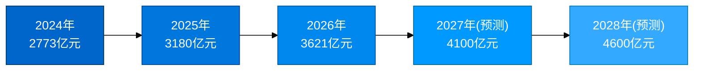
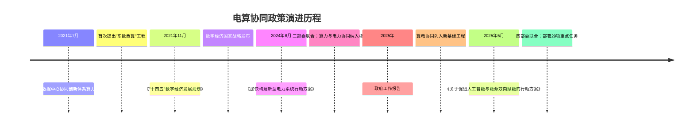
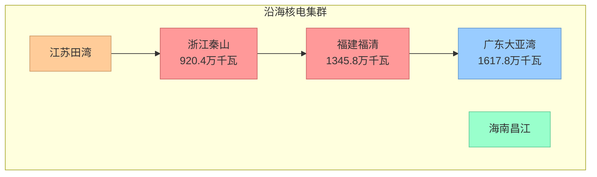
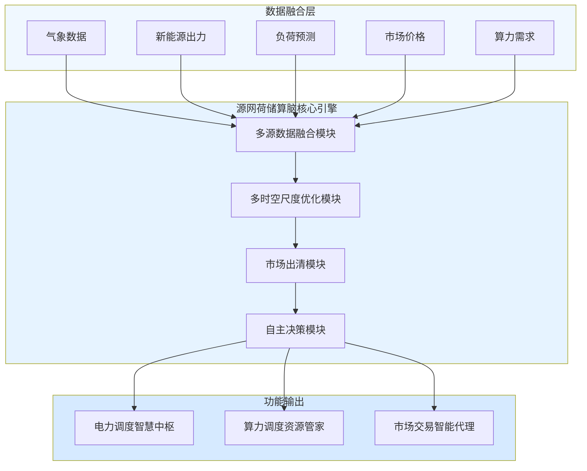
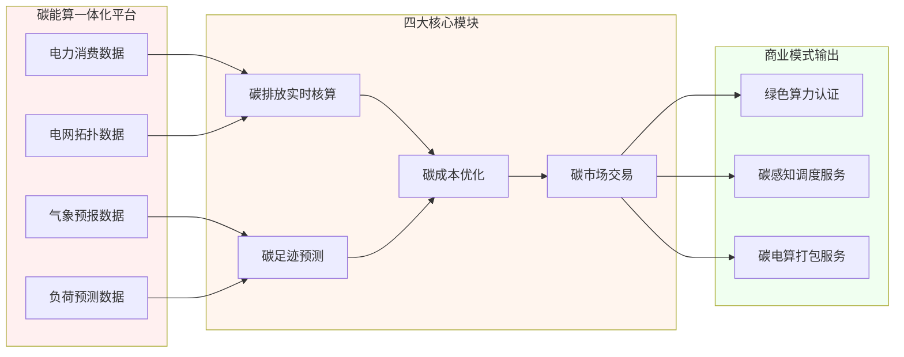
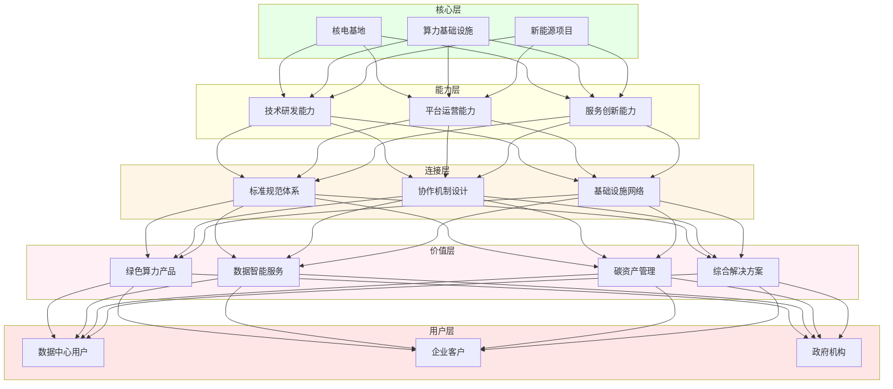
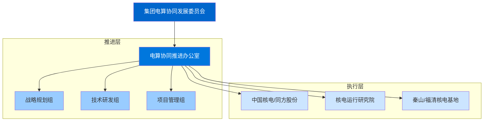
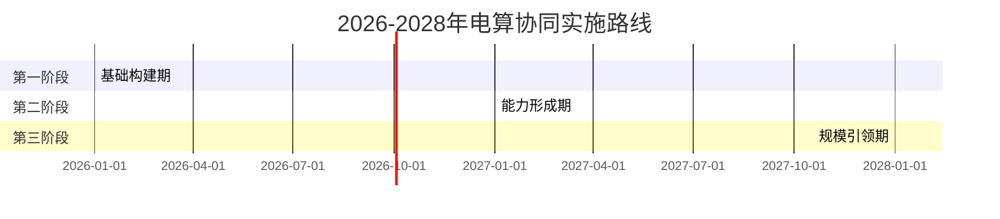

# 中核集团电算协同业务前瞻性技术研究与生态运营体系专题报告

## 编者按

本报告是中核集团科技创新业务中心围绕"电算协同"领域开展的前瞻性技术研究与生态体系分析。报告以2026年为研究起点，结合中核集团"数字核工业"战略目标、核电运行研究院等数字化转型成果、同方股份多模态大模型等技术基础，系统研判未来三至五年电算协同领域的前沿技术演进方向，深入分析生态运营体系的构建路径与关键要素，旨在为集团高层决策提供具有战略预见性的智库支撑。

---

## 摘要

电算协同作为新型电力系统建设与数字经济深度融合的核心命题，正从"概念验证"阶段加速迈向"规模化落地"阶段。以2026年为新起点，结合中核集团"十四五"圆满收官、"十五五"良好开局的发展要求，电算协同领域将呈现三大趋势性变化：一是技术架构从"单点智能"向"系统智能"跃迁；二是商业模式从"单一供电"向"多元服务"转型；三是产业生态从"链式协作"向"网络协同"演进。

本报告核心研判：**技术前沿方面**识别五大技术方向；**生态运营方面**构建四层生态体系；**战略建议方面**提出2026-2028年分阶段实施路径。

---

## 一、电算协同发展态势与研究框架

### 1.1 2026年电算协同发展新阶段

进入2026年，电算协同领域呈现出三个标志性变化，标志着该领域正式从"导入期"迈入"成长期"。

#### 1.1.1 市场规模与增长态势

**核心数据一览：**

| 指标类别 | 具体指标 | 2024年数据 | 2025年预测 | 数据来源 |
|----------|----------|------------|------------|----------|
| 市场规模 | 中国数据中心市场规模 | 2773亿元 | 3180亿元 | 中商产业研究院 |
| 能耗规模 | 数据中心耗电量 | 2500亿千瓦时 | - | 行业统计 |
| 能耗占比 | 数据中心占全社会用电比重 | 2.6% | - | 行业统计 |
| 碳市场 | 全国碳市场年成交额 | 181.14亿元 | - | 上海环境能源交易所 |
| 碳价格 | 全国碳市场配额均价 | 99.4元/吨 | - | 上海环境能源交易所 |
| 绿色水平 | 数据中心平均PUE | 1.46 | - | 中国信通院 |
| 机架规模 | 全国在用标准机架 | 900万+ | - | 中国信通院 |

**市场规模增长趋势：**



> **数据洞察**：数据中心市场规模年均增长率超过20%，2024-2028年市场规模近乎翻倍，市场空间巨大。

#### 1.1.2 政策演变脉络与未来预测

**政策演进时间轴：**



**政策演变四大趋势：**

| 趋势维度 | 当前状态 | 未来演变方向 |
|----------|----------|--------------|
| **政策主体** | 发改委、能源局、工信部、数据局四部门协同 | 扩展至更广泛的政府部门协同 |
| **政策工具** | 规划引导为主 | 向市场机制深化 |
| **政策目标** | 电力保供优先 | 向"绿色低碳"升级 |
| **政策范围** | 算力跟随电力 | 向"电力跟随算力"拓展 |

#### 1.1.3 电力现货市场建设进展

| 省份/区域 | 正式运行时间 | 备注 |
|-----------|--------------|------|
| **山西** | 2023年 | 全国首批 |
| **山东** | 2024年 | 转入正式运行 |
| **广东** | 2024年 | 转入正式运行 |
| **甘肃** | 2024年 | 转入正式运行 |
| **蒙西** | 2025年2月 | 全国第5个正式运行省级市场 |
| **省间市场** | 2024年10月 | 全国统一电力市场 |

---

## 二、中核集团业务基础与电算协同契合度分析

### 2.1 中核集团核电容装规模与布局

#### 2.1.1 在运核电资产规模

**核电资产核心数据：**

| 指标 | 数据 | 说明 |
|------|------|------|
| 在运核电机组 | 25台 | 截至2024年12月 |
| 在运装机容量 | 2375万千瓦 | 约23.75GW |
| 在建及核准机组 | 18台 | 装机2064万千瓦 |
| WANO满分机组比例 | **连续三年世界第一** | 运行业绩领先 |
| 核电工程建造安装能力 | **世界第一** | 综合实力强劲 |

**核电基地地理分布：**



#### 2.1.2 核电在电算协同中的战略价值

**核电三大核心优势对比：**

| 特性维度 | 核电 | 煤电 | 风光新能源 |
|----------|------|------|-----------|
| **碳排放** | 12克/千瓦时 | 900克/千瓦时 | 视情况 |
| **出力稳定性** | ★★★★★ | ★★★★ | ★★ |
| **基荷能力** | 完全具备 | 具备 | 不具备 |
| **调峰灵活性** | 有限 | 较好 | 较差 |
| **算力供电保障** | 极高 | 高 | 低 |

> **战略洞察**：核电是唯一能够同时满足"零碳排放+稳定基荷+高可靠性"三重特性的电源，是绿色算力的最佳能源来源。

---

## 三、前瞻性技术深度研究

### 3.1 技术成熟度综合评估

**电算协同技术成熟度雷达图：**

```mermaid
radar-chart
    title 电算协同技术成熟度评估
    "数字孪生" : 85
    "边缘智能" : 80
    "电力大模型" : 60
    "源网荷储算脑" : 55
    "碳能算一体化" : 50
    "具身智能" : 40
    "量子计算" : 25
```

**技术成熟度详细矩阵：**

| 技术方向 | 基础研究 | 技术攻关 | 应用验证 | 规模推广 | 预计成熟时间 | 中核已有基础 |
|----------|:--------:|:--------:|:--------:|:--------:|:-------------|--------------|
| **数字孪生** | ●●●●○ | ●●●○○ | ●●●○○ | ●●○○○ | 2025-2026年 | 金七门"新质华龙" |
| **边缘智能** | ●●●●● | ●●●●○ | ●●●●○ | ●●●○○ | 2025年 | 秦山、福清基地 |
| **电力大模型** | ●●●○○ | ●●●○○ | ●●○○○ | ●○○○○ | 2026-2027年 | 同方股份多模态大模型 |
| **源网荷储算脑** | ●●●○○ | ●●○○○ | ●○○○○ | ○○○○○ | 2027-2028年 | 核电调度优化 |
| **碳能算一体化** | ●●●○○ | ●●○○○ | ●○○○○ | ○○○○○ | 2027-2028年 | 核电零碳优势 |
| **具身智能** | ●●○○○ | ●○○○○ | ○○○○○ | ○○○○○ | 2028-2030年 | 核电站运维机器人 |
| **量子计算** | ●○○○○ | ○○○○○ | ○○○○○ | ○○○○○ | 2030年以后 | 需从零起步 |

> 图例：●●●○○ = 75%完成度，○表示未完成

### 3.2 源网荷储算脑技术架构



### 3.3 碳能算一体化平台架构



---

## 四、生态运营体系关键研究

### 4.1 四层生态体系架构



### 4.2 组织架构建议



### 4.3 合作伙伴生态网络

```mermaid
graph TB
    subgraph 生态核心
        CNNC["中核集团"]
    end
    
    subgraph 技术伙伴
        T1["华为"]
        T2["阿里"]
        T3["百度"]
        T4["同方股份"]
    end
    
    subgraph 电网伙伴
        E1["国家电网"]
        E2["南方电网"]
    end
    
    subgraph 科研伙伴
        R1["清华大学"]
        R2["北京大学"]
        R3["中科院"]
    end
    
    subgraph 金融伙伴
        F1["产业基金"]
        F2["投资机构"]
    end
    
    subgraph 政府伙伴
        G1["发改委"]
        G2["能源局"]
        G3["数据局"]
    end
    
    CNNC --> T1 & T2 & T3 & T4
    CNNC --> E1 & E2
    CNNC --> R1 & R2 & R3
    CNNC --> F1 & F2
    CNNC --> G1 & G2 & G3
    
    style CNNC fill:#ff0000,color:#fff
    style T1 & T2 & T3 & T4 fill:#ff9900
    style E1 & E2 fill:#33cc33
    style R1 & R2 & R3 fill:#0099ff
    style F1 & F2 fill:#9966ff
    style G1 & G2 & G3 fill:#666666,color:#fff
```

---

## 五、生态运营关键路径与实施建议

### 5.1 三阶段实施路线图



**三阶段关键里程碑：**

| 阶段 | 时间 | 核心任务 | 关键里程碑 |
|------|------|----------|------------|
| **第一阶段** | 2026年 | 顶层设计+试点启动 | 发布战略白皮书；大模型1.0发布 |
| **第二阶段** | 2027年 | 能力建设+示范运营 | 商业化运营；数字孪生全覆盖 |
| **第三阶段** | 2028年 | 规模扩张+生态引领 | 3-5个一体化基地；盈亏平衡 |

### 5.2 投资估算与资源配置

**资金投入规划：**

| 阶段 | 时间 | 投资规模 | 资金来源 |
|------|------|----------|----------|
| 第一阶段 | 2026年 | 5-8亿元 | 集团自有+政策性贷款 |
| 第二阶段 | 2027年 | 7-10亿元 | 集团自有+产业基金 |
| 第三阶段 | 2028年 | 3-7亿元 | 市场化融资+收益再投入 |
| **合计** | 2026-2028年 | **15-25亿元** | 多元化融资渠道 |

**人才队伍建设：**

| 类型 | 数量 | 引进重点 |
|------|------|----------|
| 复合型人才 | 150+人 | AI大模型、数字孪生、电力系统、碳资产管理 |

### 5.3 风险管控矩阵

| 风险类型 | 风险等级 | 主要应对策略 |
|----------|----------|--------------|
| 技术风险 | ★★★ | 小步快跑、快速迭代 |
| 市场风险 | ★★ | 战略定力+灵活调整 |
| 竞争风险 | ★★★ | 差异化竞争+生态共建 |
| 政策风险 | ★★ | 密切跟踪+积极参与 |
| 安全风险 | ★★★★ | 纵深防御+底线思维 |

> 注：★★★★为最高风险等级

---

## 六、结语与展望

电算协同作为新型电力系统建设与数字经济深度融合的战略性方向，正在从概念走向现实、从试点走向规模。以2026年为新起点，电算协同领域将迎来关键技术加速成熟、生态体系加速成型、市场空间加速释放的历史性窗口期。

**中核集团应把握历史机遇**，以"强核强国、造福人类"的企业使命为引领，以"核电+绿色算力"为核心特色，以"技术引领+生态共建"为双轮驱动，在电算协同这一战略性赛道上加快布局、持续深耕，为集团高质量发展注入新动能，为国家能源转型和数字经济发展作出新贡献。

---

## 附录

### 附录一：电算协同关键数据汇总表

| 指标类别 | 具体指标 | 2024年数据 | 数据来源 |
|----------|----------|------------|----------|
| 市场规模 | 中国数据中心市场规模 | 2773亿元 | 中商产业研究院 |
| 能耗规模 | 数据中心耗电量 | 2500亿千瓦时 | 行业统计 |
| 能耗占比 | 占全社会用电比重 | 2.6% | 行业统计 |
| 碳市场 | 全国碳市场年成交额 | 181.14亿元 | 上海环境能源交易所 |
| 碳价格 | 碳配额均价 | 99.4元/吨 | 上海环境能源交易所 |
| 绿色水平 | 数据中心平均PUE | 1.46 | 中国信通院 |
| 机架规模 | 全国在用标准机架 | 900万+ | 中国信通院 |
| 核电规模 | 中核在运装机容量 | 2375万千瓦 | 中国核电年报 |

### 附录二：电算协同政策演进时间表

| 时间节点 | 政策文件 | 核心内容 |
|----------|---------|----------|
| 2021年7月 | 《全国一体化大数据中心协同创新体系算力枢纽实施方案》 | 首次提出"东数西算"工程 |
| 2021年11月 | 《"十四五"数字经济发展规划》 | 数字经济国家战略 |
| 2024年8月 | 《加快构建新型电力系统行动方案（2024—2027年）》 | 首次将"算力与电力协同"列为核心任务 |
| 2025年 | 政府工作报告 | 明确"算电协同"新基建工程 |
| 2025年5月 | 《关于促进人工智能与能源双向赋能的行动方案》 | 四部门部署29项重点任务 |

### 附录三：电力现货市场建设进展

| 省份/区域 | 正式运行时间 | 备注 |
|-----------|--------------|------|
| 山西 | 2023年 | 全国首批 |
| 山东 | 2024年 | 转入正式运行 |
| 广东 | 2024年 | 转入正式运行 |
| 甘肃 | 2024年 | 转入正式运行 |
| 蒙西 | 2025年2月 | 全国第5个正式运行省级市场 |
| 省间市场 | 2024年10月 | 全国统一电力市场 |

### 附录四：技术成熟度评估矩阵

| 技术方向 | 预计成熟时间 | 中核已有基础 |
|----------|--------------|--------------|
| 数字孪生 | 2025-2026年 | 金七门"新质华龙"精益建造 |
| 边缘智能 | 2025年 | 秦山、福清等基地数字化基础 |
| 电力大模型 | 2026-2027年 | 同方股份多模态大模型 |
| 源网荷储算脑 | 2027-2028年 | 核电调度优化经验 |
| 碳能算一体化 | 2027-2028年 | 核电零碳优势 |
| 具身智能（核电） | 2028-2030年 | 核电站运维机器人 |
| 量子计算应用 | 2030年以后 | 需从零起步 |

---

**报告编制说明**：本报告为中核集团科技创新业务中心内部智库研究成果，基于公开信息、行业研究和企业调研形成，**结合了中核集团"数字核工业"战略、核电运行研究院、同方股份等实际业务基础**，部分前瞻性判断存在不确定性，仅供集团高层领导决策参考。

**引用说明**：
[^1]: 中商产业研究院，2024年中国数据中心行业市场前景预测研究报告。
[^2]: 中国信通院数据，2025年算力中心用电量数据。
[^3]: 行业统计数据，2024年中国数据中心耗电量。
[^4]: 摩根士丹利研究报告，中国数据中心2024-2027年耗电量预测。
[^5]: 上海环境能源交易所，2024年全国碳市场交易数据。
[^6]: 碳市场数据回顾与展望，2024年碳价数据。
[^7]: 中国信通院，绿色算力发展研究报告（2025年）。
[^8]: 国家发改委等三部门，《加快构建新型电力系统行动方案（2024—2027年）》，2024年8月。
[^9]: 电力现货市场建设全面提速报道，2024年。
[^10]: 省间电力现货市场转入正式运行报道，2024年10月。
[^11]: 2025年政府工作报告。
[^12]: 四部门联合发文，《关于促进人工智能与能源双向赋能的行动方案》，2025年5月。
[^13]: 《2025年能源工作指导意见》。
[^14]: 蒙西电力现货市场正式运行报道，2025年2月。
[^15]: 中国核电年报，截至2024年12月末数据。
[^16]: 行业研究数据，中国在运和在建核电机组装机容量。
[^17]: 各省核电装机容量排名数据。
[^18]: 中核集团"十四五"能源发展成就综述。
[^19]: 金七门核电建设报道。

**编制单位**：科技创新业务中心
**编制日期**：2026年5月
**密级**：内部资料，请妥善保管