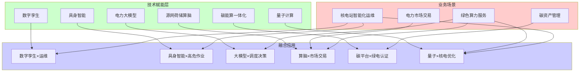
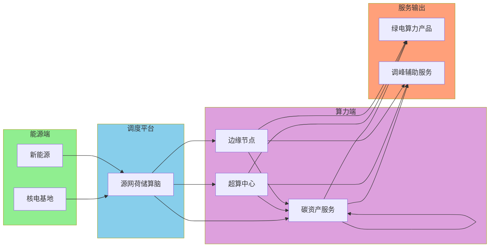
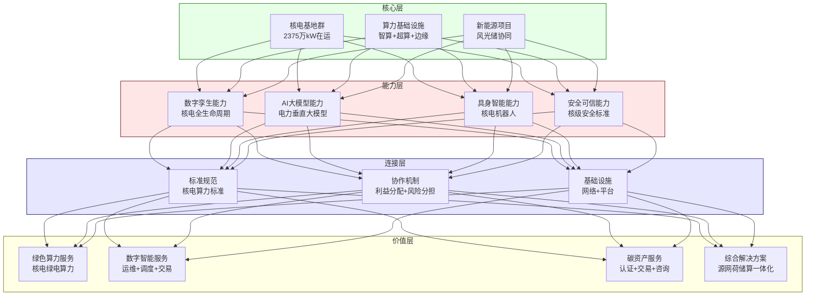
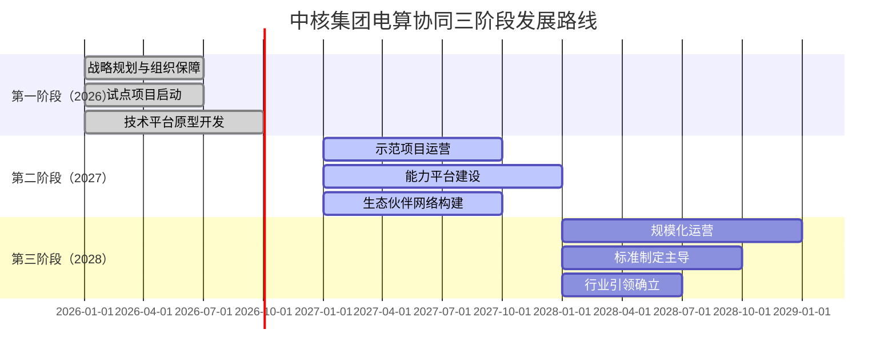
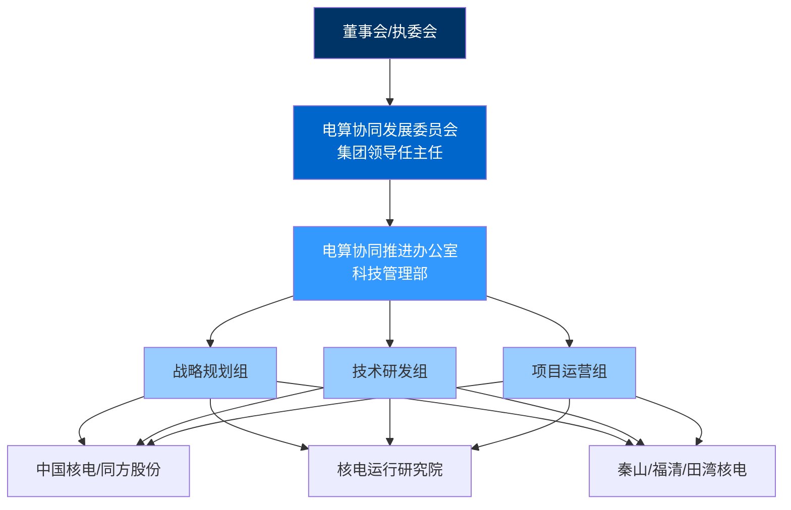

# 中核集团电算协同业务前瞻性技术研究与生态运营体系专题报告

> **报告定位**：供集团高层领导决策参考的战略级智库报告
> 
> **研究起点**：2026年
> 
> **密级**：内部资料

---

## 摘要

电算协同作为新型电力系统建设与数字经济深度融合的核心命题，正在加速从"概念验证"迈向"规模化落地"。本报告以2026年为研究起点，从国家算力布局战略高度审视中核集团电算协同业务的独特价值，系统研判前瞻性技术与业务融合的关键路径，为集团战略决策提供前瞻性智库支撑。

### 核心研判

**战略定位研判**：中核集团在国家"东数西算"和"新型电力系统"双重战略交汇点上占据独特地位。核电作为唯一能够同时满足"零碳+稳定+可靠"三重特性的电源，是国家算力基础设施实现绿色转型的关键支撑。中核集团应将电算协同定位为**服务国家战略的核心业务**，而非单纯的多元化探索。

**技术融合研判**：前瞻性技术与电算协同业务的结合点集中在三个维度——核电站智能化运维（数字孪生+具身智能）、核电商用场景创新（电力大模型+碳能算一体化）、核电科学计算支撑（量子计算+高性能计算）。这三个维度构成了中核电算协同业务的技术护城河。

**生态位势研判**：中核集团应构建"核电算力+绿色算力认证+碳资产服务"三位一体的差异化竞争优势，在国家算力生态中确立"绿色算力核心供应商"的独特定位。

---

## 一、国家算力布局战略视角下的电算协同

### 1.1 国家算力战略的顶层设计逻辑

#### 1.1.1 "东数西算"工程的战略意图

国家实施"东数西算"工程具有深层次的战略考量：

**能源安全维度**：我国数据中心耗电量持续攀升，2024年已超过2500亿千瓦时，约占全社会用电量的2.6%。到2030年预计将突破5000亿千瓦时。数据中心作为"数字时代的电力大户"，其能源供应安全已上升为国家战略议题。

**双碳目标维度**：数据中心碳排放问题日益突出。2024年数据中心行业碳排放约占全国总排放的2%，且仍在快速增长。在"双碳"目标约束下，数据中心的绿色化转型成为刚性需求。

**区域协调发展维度**："东数西算"希望通过算力基础设施的西部布局，带动西部新能源消纳和经济发展，实现"算力西迁"与"绿电东送"的双向协同。

#### 1.1.2 新型电力系统建设的核心诉求

构建以新能源为主体的新型电力系统面临三大挑战：

**灵活性资源短缺**：新能源出力具有间歇性和波动性，需要大量灵活性资源进行调节。传统火电灵活性改造空间有限，储能成本尚未完全解决，灵活性资源缺口日益扩大。

**系统平衡难度增加**：新能源发电占比提升使得电力系统"源随荷动"的传统模式难以为继，需要发展"源网荷储"协调互动的新型模式。

**市场机制创新需求**：适应新能源高渗透率的市场机制尚未完善，电力现货市场、辅助服务市场、容量市场等制度建设仍需深化。

#### 1.1.3 电算协同的战略价值

电算协同正是解决上述问题的"关键一招"：

| 国家战略诉求 | 电算协同的解决路径 | 中核的独特价值 |
|-------------|-------------------|----------------|
| 数据中心绿色化 | 绿电直供+碳足迹追溯 | 核电零碳+稳定基荷 |
| 灵活性资源挖掘 | 算力负荷参与调峰 | 核电+算力协同调度 |
| 新型电力系统 | 源网荷储算一体化 | 核电全产业链优势 |
| 区域协调发展 | 算力西迁+绿电东送 | 沿海核电基地布局 |

### 1.2 国家算力版图中的中核定位

#### 1.2.1 现有算力布局格局

| 算力枢纽 | 主要特点 | 能源结构 | 中核机会 |
|---------|---------|---------|---------|
| 京津冀枢纽 | 算力需求最大 | 火电为主 | 可布局绿电算力 |
| 长三角枢纽 | AI算力聚集 | 外来电为主 | 秦山核电基地 |
| 粤港澳枢纽 | 智算中心密集 | 煤电+核电 | 大亚湾核电基地 |
| 成渝枢纽 | 新型算力崛起 | 水电为主 | 可联动布局 |
| 贵州/甘肃枢纽 |清洁能源丰富 | 风光为主 | 可联动布局 |

#### 1.2.2 中核集团的战略卡位

**核心卡位一：绿色算力核心供应商**

中核集团应定位为国家算力基础设施的"绿色能源心脏"。核电的三大特性使其成为数据中心最理想的能源来源：

```
核电特性 → 数据中心价值
━━━━━━━━━━━━━━━━━━━━━━━━━━━━
零碳排放（12g/kWh）→ 满足双碳要求，获得碳溢价
稳定基荷（7×24h）→ 保障算力连续运行，消除供电波动风险
调节可控 → 可参与调峰辅助服务，创造额外收益
```

**核心卡位二：电算协同标准制定者**

依托中核集团的行业地位和技术积累，应积极参与甚至主导电算协同领域国家标准和行业标准的制定：

- 核电算力基础设施技术规范
- 绿色算力碳足迹核算标准
- 源网荷储算脑接口标准
- 电算协同安全评估标准

**核心卡位三：电算协同示范引领者**

通过打造"核电+算力"一体化示范项目，形成可复制、可推广的发展模式，为国家电算协同战略提供"中核方案"。

---

## 二、前瞻性技术与电算协同业务的深度融合

### 2.1 技术-业务融合矩阵



### 2.2 融合点一：数字孪生 × 核电站智能化运维

#### 2.2.1 融合逻辑

核电站是高度复杂的系统性工程，其运行、维护、安全管理涉及海量数据和复杂决策。数字孪生技术可以为核电站构建高保真数字镜像，实现物理世界与数字世界的实时映射。

#### 2.2.2 具体应用场景

| 应用场景 | 技术融合点 | 预期效果 |
|---------|-----------|---------|
| 全生命周期数字孪生 | 3D可视化+实时数据+AI推理 | 设备状态实时感知 |
| 设备健康预测 | 机理模型+数据驱动+时序分析 | 故障预警提前30天 |
| 运行优化决策 | 数字仿真+优化算法+专家知识 | 提升发电效率2-5% |
| 应急演练仿真 | 事故仿真+VR/AR+决策支持 | 提升应急响应能力 |

#### 2.2.3 中核已有基础与差距

**已有基础**：
- 金七门核电"新质华龙"精益建造数字孪生实践
- 秦山、福清等基地的数字化改造
- 核电运行研究院的数字化研发能力

**需要补强**：
- 实时数字孪生技术（毫秒级同步）
- AI推理引擎与数字孪生深度集成
- 跨基地统一的数字孪生平台

### 2.3 融合点二：具身智能 × 核电高危作业

#### 2.3.1 融合逻辑

核电站存在大量高辐射、高温、高压等危险作业环境，传统人工作业面临人员安全风险和用工短缺问题。具身智能技术可以替代人类执行这些危险任务。

#### 2.3.2 具体应用场景

| 应用场景 | 技术融合点 | 预期效果 |
|---------|-----------|---------|
| 核岛巡检机器人 | 多模态感知+自主导航+缺陷识别 | 减少人员辐照剂量80% |
| 带电作业机器人 | 力控操作+视觉引导+安全联锁 | 提升作业效率50% |
| 燃料组件操作机器人 | 精密定位+力柔顺控制+防错机制 | 零失误操作保障 |
| 应急处置机器人 | 远程遥操作+特种机构+核辐射耐受 | 提升应急响应能力 |

#### 2.3.3 战略价值

具身智能在核电领域的应用不仅能解决安全和用工问题，更能形成中核集团独特的**技术护城河**：

```
具身智能核电应用 → 技术积累 → 行业标准制定 → 市场独占
```

### 2.4 融合点三：电力大模型 × 智能调度决策

#### 2.4.1 融合逻辑

电力系统运行涉及海量数据、复杂规则和专业经验。电力大模型可以将这些知识进行有效整合，为调度人员提供智能辅助决策。

#### 2.4.2 具体应用场景

| 应用场景 | 技术融合点 | 预期效果 |
|---------|-----------|---------|
| 调度指令生成 | 自然语言理解+调度规则+历史案例 | 指令生成效率提升70% |
| 异常工况诊断 | 专家知识+实时数据+因果推理 | 诊断准确率提升至95% |
| 市场策略优化 | 价格预测+供需分析+博弈论 | 交易收益提升5-10% |
| 负荷预测 | 时序模型+气象数据+事件感知 | 预测精度提升15% |

#### 2.4.3 中核独特优势

中核集团电力大模型应聚焦核电特色场景：

- **核电商用策略**：基于核电成本结构的市场报价模型
- **核电调峰优化**：核电参与调峰的智能决策支持
- **多基地协同调度**：集团内部核电机组的协调优化

### 2.5 融合点四：源网荷储算脑 × 绿电算力服务

#### 2.5.1 融合逻辑

源网荷储算脑将算力负荷纳入电力系统调度体系，实现"电-算"联合优化。这为核电+算力一体化提供了核心技术支撑。

#### 2.5.2 具体应用场景

| 应用场景 | 技术融合点 | 预期效果 |
|---------|-----------|---------|
| 核电-算力联合调度 | 分层优化+实时响应+市场联动 | 算力成本降低10-15% |
| 绿电算力认证 | 碳流追踪+实时核算+区块链存证 | 可信绿色算力溯源 |
| 调峰辅助服务 | 算力弹性+核电配合+市场交易 | 额外收益来源 |
| 需求响应聚合 | 负荷聚合+调度优化+结算分账 | 参与电网调节 |

#### 2.5.3 商业模式创新



### 2.6 融合点五：碳能算一体化 × 绿色算力认证

#### 2.6.1 融合逻辑

在"双碳"时代，数据中心的碳排放成为客户选择供应商的重要考量。碳能算一体化平台可以为绿色算力提供可信的碳足迹认证。

#### 2.6.2 具体应用场景

| 应用场景 | 技术融合点 | 预期效果 |
|---------|-----------|---------|
| 核电碳足迹核算 | 生命周期评价+实时监测+核查认证 | 权威零碳认证 |
| 绿电算力溯源 | 区块链存证+电力流追踪+时间戳 | 防伪溯源 |
| 碳成本优化 | 碳价预测+调度优化+成本传导 | 最优碳效益 |
| 碳资产管理 | 碳配额管理+CCER开发+碳交易 | 碳资产增值 |

#### 2.6.3 市场价值

| 服务类型 | 溢价空间 | 目标客户 |
|---------|---------|---------|
| 核电绿电算力认证 | 5-15% | 互联网大厂、科技企业 |
| 碳足迹报告服务 | 2-5% | 上市公司、出口企业 |
| 碳中和解决方案 | 面议 | 外资企业、ESG要求高企业 |

### 2.7 融合点六：量子计算 × 核电科学计算

#### 2.7.1 融合逻辑

核能科学研究涉及大量高复杂度计算问题，如核反应堆物理仿真、材料辐照损伤模拟等。量子计算在这些问题上具有天然优势。

#### 2.7.2 具体应用场景

| 应用场景 | 技术融合点 | 预期效果 |
|---------|-----------|---------|
| 反应堆优化设计 | 量子模拟+多物理场耦合 | 设计周期缩短30% |
| 燃料管理优化 | 量子优化+组合规划 | 燃料利用率提升 |
| 设备维护排程 | 量子调度+约束优化 | 维护效率提升20% |
| 辐射防护优化 | 蒙特卡罗+量子采样 | 计算加速100倍 |

#### 2.7.3 战略布局建议

量子计算商业化应用仍需时日，建议采取"**能力储备+场景聚焦**"策略：

- 2026-2027年：与本源量子等建立合作，跟踪技术进展
- 2028-2029年：在非实时优化场景开展试点
- 2030年以后：根据技术成熟度决定规模化投入

---

## 三、生态运营体系关键研究

### 3.1 差异化定位与核心竞争力构建

#### 3.1.1 中核电算协同的独特定位

```
┌─────────────────────────────────────────────────────────────┐
│                    国家算力生态格局                          │
├─────────────────────────────────────────────────────────────┤
│  算力供给侧：超大规模云服务商（阿里、腾讯、华为等）           │
│  能源供给侧：五大发电集团、新能源运营商                       │
│  电网调度侧：国家电网、南方电网                              │
│  ════════════════════════════════════════════════          │
│  ★ 中核集团定位：绿色算力核心供应商 + 电算协同标准制定者      │
│  ★ 差异化优势：核电零碳+稳定基荷+核级安全                    │
└─────────────────────────────────────────────────────────────┘
```

#### 3.1.2 核心竞争力矩阵

| 竞争力维度 | 核心要素 | 构建路径 | 护城河强度 |
|-----------|---------|---------|-----------|
| **能源禀赋** | 核电零碳、稳定、高可靠 | 现有基地+新建项目 | ★★★★★ |
| **技术能力** | 数字孪生、电力大模型、具身智能 | 自研+合作 | ★★★★ |
| **标准主导** | 电算协同行业标准、国家标准 | 牵头制定 | ★★★★★ |
| **品牌信任** | 核级安全文化、质量保障 | 核电口碑延伸 | ★★★★ |
| **生态连接** | 电网合作、云商合作、政府关系 | 战略合作 | ★★★ |

### 3.2 四层生态体系架构



### 3.3 合作伙伴生态网络

| 合作伙伴类型 | 战略价值 | 合作重点 | 代表企业 |
|-------------|---------|---------|---------|
| **算力技术厂商** | 技术赋能 | AI大模型、云计算、基础设施 | 华为、阿里、百度 |
| **电网企业** | 市场准入 | 调度接入、电力市场、绿电采购 | 国网、南网 |
| **云服务商** | 市场渠道 | 算力分销、联合运营、品牌背书 | 阿里云、腾讯云、华为云 |
| **科研机构** | 前沿创新 | 联合研发、人才培养、标准制定 | 清华、中科院 |
| **碳服务机构** | 碳业务支撑 | 碳认证、碳交易、碳核查 | 碳交所、核查机构 |
| **IDC运营商** | 运营经验 | 合作运营、经验借鉴 | 万国数据、秦淮数据 |
| **投资机构** | 资本支持 | 项目融资、产业基金 | 国新建投、诚通 |

---

## 四、实施建议与保障措施

### 4.1 战略定位与愿景

**战略定位**：国家绿色算力核心供应商 + 电算协同标准制定者

**发展愿景**：到2028年，成为国内领先、国际一流的核电驱动绿色算力服务商，形成"核电+算力+碳资产"三位一体的发展格局。

### 4.2 三阶段实施路线



| 阶段 | 时间 | 核心目标 | 关键里程碑 |
|------|------|---------|-----------|
| **第一阶段** | 2026年 | 战略布局 | 战略白皮书发布；秦山/福清试点启动 |
| **第二阶段** | 2027年 | 能力形成 | 示范项目运营；大模型1.0发布 |
| **第三阶段** | 2028年 | 规模引领 | 3-5个基地运营；行业标准发布 |

### 4.3 组织与治理

**三层架构**：



### 4.4 资源配置

**资金投入**：15-25亿元（分三年投入）

| 来源 | 比例 | 金额 |
|------|------|------|
| 集团自有资金 | 50% | 7.5-12.5亿元 |
| 政策性贷款 | 20% | 3-5亿元 |
| 产业投资基金 | 20% | 3-5亿元 |
| 市场化融资 | 10% | 1.5-2.5亿元 |

**人才队伍**：三年内引进培养150+复合型人才

| 人才类型 | 引进重点 | 培养路径 |
|---------|---------|---------|
| AI大模型专家 | 10-15人 | 外部引进+内部培养 |
| 数字孪生专家 | 10-15人 | 外部引进+项目实战 |
| 电力系统专家 | 15-20人 | 内部转型+外部引进 |
| 碳资产管理专家 | 5-10人 | 外部引进+专业培训 |
| 平台运营专家 | 10-15人 | 外部引进+行业交流 |

---

## 五、结语与展望

### 5.1 核心结论

**战略层面**：电算协同不是"锦上添花"的可选业务，而是中核集团服务国家战略、实现转型升级的**核心战略方向**。在"双碳"目标和"数字中国"战略的双重驱动下，电算协同正处于历史性发展窗口期。

**技术层面**：前瞻性技术与电算协同业务的深度融合，将形成中核集团独特的技术护城河。数字孪生、具身智能、电力大模型、源网荷储算脑、碳能算一体化五大技术方向，需要系统布局、重点突破。

**生态层面**：中核集团应构建"核电算力+绿色认证+碳资产"三位一体的差异化竞争优势，在国家算力生态中确立"绿色算力核心供应商"的独特定位。

### 5.2 战略建议

1. **提升战略定位**：将电算协同提升为集团核心战略业务，而非单纯的多元化探索
2. **加快布局节奏**：2026年完成战略规划，2027年建成示范项目，2028年形成规模效应
3. **强化技术引领**：依托核电运行研究院和同方股份，加快核心技术研发
4. **主导标准制定**：积极参与国家标准、行业标准制定，争取行业话语权
5. **构建开放生态**：与电网企业、云服务商、科研机构建立战略合作

### 5.3 未来展望

展望2030年，中核集团电算协同业务有望形成以下格局：

- **算力规模**：运营绿色算力超过50000P
- **碳资产**：管理核电碳资产超过500万吨
- **技术标准**：主导制定3-5项国家标准
- **行业地位**：成为国内领先、国际一流的绿色算力服务商

中核集团应以"强核强国、造福人类"的企业使命为引领，在电算协同这一战略性赛道上勇毅前行，为国家能源转型和数字经济发展贡献"中核力量"。

---

## 附录

### 附录一：关键数据汇总

| 指标类别 | 具体指标 | 数据 |
|---------|---------|------|
| 市场规模 | 中国数据中心市场规模（2024） | 2773亿元 |
| 能耗规模 | 数据中心耗电量（2024） | 2500亿千瓦时 |
| 能耗占比 | 占全社会用电比重 | 2.6% |
| 碳市场 | 全国碳市场年成交额（2024） | 181.14亿元 |
| 碳价格 | 碳配额均价 | 99.4元/吨 |
| 核电规模 | 中核在运装机容量 | 2375万千瓦 |
| 核电机组 | 中核在运核电机组 | 25台 |
| 竞争优势 | WANO满分机组比例 | **连续三年世界第一** |

### 附录二：技术成熟度评估

| 技术方向 | 成熟度 | 中核基础 | 建议策略 |
|---------|-------|---------|---------|
| 数字孪生 | ★★★★☆ | 金七门实践 | 深化应用 |
| 边缘智能 | ★★★★☆ | 基地数字化 | 规模推广 |
| 电力大模型 | ★★★☆☆ | 同方股份 | 重点突破 |
| 源网荷储算脑 | ★★★☆☆ | 核电调度 | 试点验证 |
| 碳能算一体化 | ★★★☆☆ | 核电零碳 | 标准引领 |
| 具身智能 | ★★☆☆☆ | 运维机器人 | 安全突破 |
| 量子计算 | ★☆☆☆☆ | 需起步 | 能力储备 |

### 附录三：政策演进时间轴

| 时间节点 | 政策文件 | 核心内容 |
|---------|---------|----------|
| 2021年7月 | 《全国一体化大数据中心协同创新体系算力枢纽实施方案》 | "东数西算"工程启动 |
| 2024年8月 | 《加快构建新型电力系统行动方案（2024—2027年）》 | 算力与电力协同纳入核心任务 |
| 2025年5月 | 《关于促进人工智能与能源双向赋能的行动方案》 | 四部门部署29项重点任务 |
| 2025年 | 政府工作报告 | 算电协同列入新基建工程 |

---

**报告编制**：科技创新业务中心

**编制日期**：2026年5月

**密级**：内部资料

**免责声明**：本报告基于公开信息和行业研究形成，部分前瞻性判断存在不确定性，仅供集团高层领导决策参考。